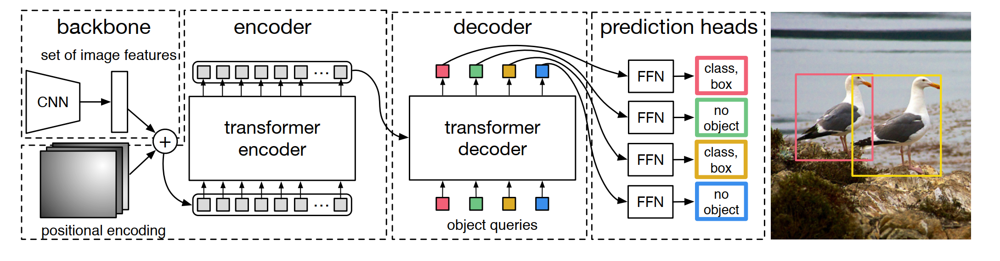

<h2 align="left">detrex</h2>
<p align="left">
    <a href="https://github.com/IDEA-Research/detrex/releases">
        
    </a>
    <a href="https://detrex.readthedocs.io/en/latest/index.html">
        
    </a>
    <a href='https://detrex.readthedocs.io/en/latest/?badge=latest'>
    
    </a>
    <a href="https://github.com/IDEA-Research/detrex/blob/main/LICENSE">
        
    </a>
    <a href="https://github.com/IDEA-Research/detrex/pulls">
        
    </a>
    <a href="https://github.com/IDEA-Research/detrex/issues">
        
    </a>
</p>

[📘Documentation](https://detrex.readthedocs.io/en/latest/index.html) |
[🛠️Installation](https://detrex.readthedocs.io/en/latest/tutorials/Installation.html) |
[👀Model Zoo](https://detrex.readthedocs.io/en/latest/tutorials/Model_Zoo.html) |
[🚀Awesome DETR](https://github.com/IDEA-Research/awesome-detection-transformer) |
[🆕News](#whats-new) |
[🤔Reporting Issues](https://github.com/IDEA-Research/detrex/issues/new/choose)


## Introduction

detrex is an open-source toolbox that provides state-of-the-art Transformer-based detection algorithms. It is built on top of [Detectron2](https://github.com/facebookresearch/detectron2) and its module design is partially borrowed from [MMDetection](https://github.com/open-mmlab/mmdetection) and [DETR](https://github.com/facebookresearch/detr). Many thanks for their nicely organized code. The main branch works with **Pytorch 1.10+** or higher (we recommend **Pytorch 1.12**).

<div align="center">
  
</div>

<details open>
<summary> Major Features </summary>

- **Modular Design.** detrex decomposes the Transformer-based detection framework into various components which help users easily build their own customized models.

- **State-of-the-art Methods.** detrex provides a series of Transformer-based detection algorithms, including [DINO](https://arxiv.org/abs/2203.03605) which reached the SOTA of DETR-like models with **63.3AP**!

- **Easy to Use.** detrex is designed to be **light-weight** and easy for users to use:
  - [LazyConfig System](https://detectron2.readthedocs.io/en/latest/tutorials/lazyconfigs.html) for more flexible syntax and cleaner config files.
  - Light-weight [training engine](./tools/train_net.py) modified from detectron2 [lazyconfig_train_net.py](https://github.com/facebookresearch/detectron2/blob/main/tools/lazyconfig_train_net.py)

Apart from detrex, we also released a repo [Awesome Detection Transformer](https://github.com/IDEA-Research/awesome-detection-transformer) to present papers about Transformer for detection and segmentation.

</details>

## Fun Facts
The repo name detrex has several interpretations:
- <font color=blue> <b> detr-ex </b> </font>: We take our hats off to DETR and regard this repo as an extension of Transformer-based detection algorithms.

- <font color=#db7093> <b> det-rex </b> </font>: rex literally means 'king' in Latin. We hope this repo can help advance the state of the art on object detection by providing the best Transformer-based detection algorithms from the research community.

- <font color=#008000> <b> de-t.rex </b> </font>: de means 'the' in Dutch. T.rex, also called Tyrannosaurus Rex, means 'king of the tyrant lizards' and connects to our research work 'DINO', which is short for Dinosaur.

## What's New
v0.3.0 was released on 03/17/2023:
- Support new algorithms including `Anchor-DETR` and `DETA`.
- Release more than 10+ pretrained models (including the converted weights): `DETR-R50 & R101`, `DETR-R50 & R101-DC5`, `DAB-DETR-R50 & R101-DC5`, `DAB-DETR-R50-3patterns`, `Conditional-DETR-R50 & R101-DC5`, `DN-DETR-R50-DC5`, `Anchor-DETR` and the `DETA-Swin-o365-finetune` model which can achieve **`62.9AP`** on coco val.
- Support **MaskDINO** on ADE20k semantic segmentation task.
- Support `EMAHook` during training by setting `train.model_ema.enabled=True`, which can enhance the model performance. DINO with EMA can achieve **`49.4AP`** with only 12epoch training.
- Support mixed precision training by setting `train.amp.enabled=True`, which will **reduce 20% to 30% GPU memory usage**.
- Support `train.fast_dev_run=True` for **fast debugging**.
- Support **encoder-decoder checkpoint** in DINO, which may reduce **30% GPU** memory usage.
- Support a great `slurm training scripts` by @rayleizhu, please check this issue for more details [#213](https://github.com/IDEA-Research/detrex/issues/213)


Please see [changelog.md](./changlog.md) for details and release history.

## Installation

Please refer to [Installation Instructions](https://detrex.readthedocs.io/en/latest/tutorials/Installation.html) for the details of installation.

## Getting Started

Please refer to [Getting Started with detrex](https://detrex.readthedocs.io/en/latest/tutorials/Getting_Started.html) for the basic usage of detrex. We also provides other tutorials for:
- [Learn about the config system of detrex](https://detrex.readthedocs.io/en/latest/tutorials/Config_System.html)
- [How to convert the pretrained weights from original detr repo into detrex format](https://detrex.readthedocs.io/en/latest/tutorials/Converters.html)
- [Visualize your training data and testing results on COCO dataset](https://detrex.readthedocs.io/en/latest/tutorials/Tools.html#visualization)
- [Analyze the model under detrex](https://detrex.readthedocs.io/en/latest/tutorials/Tools.html#model-analysis)
- [Download and initialize with the pretrained backbone weights](https://detrex.readthedocs.io/en/latest/tutorials/Using_Pretrained_Backbone.html)
- [Frequently asked questions](https://github.com/IDEA-Research/detrex/issues/109)
- [A simple onnx convert tutorial provided by powermano](https://github.com/IDEA-Research/detrex/issues/192)
- Simple training techniques: [Model-EMA](https://github.com/IDEA-Research/detrex/pull/201), [Mixed Precision Training](https://github.com/IDEA-Research/detrex/pull/198), [Activation Checkpoint](https://github.com/IDEA-Research/detrex/pull/200)
- [Simple tutorial about custom dataset training](https://github.com/IDEA-Research/detrex/pull/187)

Although some of the tutorials are currently presented with relatively simple content, we will constantly improve our documentation to help users achieve a better user experience.

## Documentation

Please see [documentation](https://detrex.readthedocs.io/en/latest/index.html) for full API documentation and tutorials.

## Model Zoo
Results and models are available in [model zoo](https://detrex.readthedocs.io/en/latest/tutorials/Model_Zoo.html).

<details open>
<summary> Supported methods </summary>

- [x] [DETR (ECCV'2020)](./projects/detr/)
- [x] [Deformable-DETR (ICLR'2021 Oral)](./projects/deformable_detr/)
- [x] [PnP-DETR (ICCV'2021)](./projects/pnp_detr/)
- [x] [Conditional-DETR (ICCV'2021)](./projects/conditional_detr/)
- [x] [Anchor-DETR (AAAI 2022)](./projects/anchor_detr/)
- [x] [DAB-DETR (ICLR'2022)](./projects/dab_detr/)
- [x] [DAB-Deformable-DETR (ICLR'2022)](./projects/dab_deformable_detr/)
- [x] [DN-DETR (CVPR'2022 Oral)](./projects/dn_detr/)
- [x] [DN-Deformable-DETR (CVPR'2022 Oral)](./projects/dn_deformable_detr/)
- [x] [Group-DETR (ArXiv'2022)](./projects/group_detr/)
- [x] [DETA (ArXiv'2022)](./projects/deta/)
- [x] [DINO (ICLR'2023)](./projects/dino/)
- [x] [H-Deformable-DETR (CVPR'2023)](./projects/h_deformable_detr/)
- [x] [MaskDINO (CVPR'2023)](./projects/maskdino/)

## Track
- [x] [CO-MOT (ArXiv'2023)](./projects/co-mot/)

Please see [projects](./projects/) for the details about projects that are built based on detrex.

</details>


## License

This project is released under the [Apache 2.0 license](LICENSE).


## Acknowledgement
- detrex is an open-source toolbox for Transformer-based detection algorithms created by researchers of **IDEACVR**. We appreciate all contributions to detrex!
- detrex is built based on [Detectron2](https://github.com/facebookresearch/detectron2) and part of its module design is borrowed from [MMDetection](https://github.com/open-mmlab/mmdetection), [DETR](https://github.com/facebookresearch/detr), and [Deformable-DETR](https://github.com/fundamentalvision/Deformable-DETR).


## Citation
If you use this toolbox in your research or wish to refer to the baseline results published here, please use the following BibTeX entries:

<details>
<summary> <b> Citation List </b> </summary>

detrex project:
```BibTeX
@misc{ideacvr2022detrex,
  author =       {detrex contributors},
  title =        {detrex: An Research Platform for Transformer-based Object Detection Algorithms},
  howpublished = {\url{https://github.com/IDEA-Research/detrex}},
  year =         {2022}
}
```

relevant publications:
```BibTex
@inproceedings{carion2020end,
  title={End-to-end object detection with transformers},
  author={Carion, Nicolas and Massa, Francisco and Synnaeve, Gabriel and Usunier, Nicolas and Kirillov, Alexander and Zagoruyko, Sergey},
  booktitle={European conference on computer vision},
  pages={213--229},
  year={2020},
  organization={Springer}
}

@article{zhu2020deformable,
  title={Deformable DETR: Deformable Transformers for End-to-End Object Detection},
  author={Zhu, Xizhou and Su, Weijie and Lu, Lewei and Li, Bin and Wang, Xiaogang and Dai, Jifeng},
  journal={arXiv preprint arXiv:2010.04159},
  year={2020}
}

@inproceedings{meng2021-CondDETR,
  title       = {Conditional DETR for Fast Training Convergence},
  author      = {Meng, Depu and Chen, Xiaokang and Fan, Zejia and Zeng, Gang and Li, Houqiang and Yuan, Yuhui and Sun, Lei and Wang, Jingdong},
  booktitle   = {Proceedings of the IEEE International Conference on Computer Vision (ICCV)},
  year        = {2021}
}

@inproceedings{
      liu2022dabdetr,
      title={{DAB}-{DETR}: Dynamic Anchor Boxes are Better Queries for {DETR}},
      author={Shilong Liu and Feng Li and Hao Zhang and Xiao Yang and Xianbiao Qi and Hang Su and Jun Zhu and Lei Zhang},
      booktitle={International Conference on Learning Representations},
      year={2022},
      url={https://openreview.net/forum?id=oMI9PjOb9Jl}
}

@inproceedings{li2022dn,
      title={Dn-detr: Accelerate detr training by introducing query denoising},
      author={Li, Feng and Zhang, Hao and Liu, Shilong and Guo, Jian and Ni, Lionel M and Zhang, Lei},
      booktitle={Proceedings of the IEEE/CVF Conference on Computer Vision and Pattern Recognition},
      pages={13619--13627},
      year={2022}
}

@misc{zhang2022dino,
      title={DINO: DETR with Improved DeNoising Anchor Boxes for End-to-End Object Detection}, 
      author={Hao Zhang and Feng Li and Shilong Liu and Lei Zhang and Hang Su and Jun Zhu and Lionel M. Ni and Heung-Yeung Shum},
      year={2022},
      eprint={2203.03605},
      archivePrefix={arXiv},
      primaryClass={cs.CV}
}

@article{chen2022group,
  title={Group DETR: Fast DETR Training with Group-Wise One-to-Many Assignment},
  author={Chen, Qiang and Chen, Xiaokang and Wang, Jian and Feng, Haocheng and Han, Junyu and Ding, Errui and Zeng, Gang and Wang, Jingdong},
  journal={arXiv preprint arXiv:2207.13085},
  year={2022}
}

@article{jia2022detrs,
  title={DETRs with Hybrid Matching},
  author={Jia, Ding and Yuan, Yuhui and He, Haodi and Wu, Xiaopei and Yu, Haojun and Lin, Weihong and Sun, Lei and Zhang, Chao and Hu, Han},
  journal={arXiv preprint arXiv:2207.13080},
  year={2022}
}

@misc{li2022mask,
      title={Mask DINO: Towards A Unified Transformer-based Framework for Object Detection and Segmentation}, 
      author={Feng Li and Hao Zhang and Huaizhe xu and Shilong Liu and Lei Zhang and Lionel M. Ni and Heung-Yeung Shum},
      year={2022},
      eprint={2206.02777},
      archivePrefix={arXiv},
      primaryClass={cs.CV}
}
@article{yan2023bridging,
 title={Bridging the Gap Between End-to-end and Non-End-to-end Multi-Object Tracking},
 author={Yan, Feng and Luo, Weixin and Zhong, Yujie and Gan, Yiyang and Ma, Lin},
 journal={arXiv preprint arXiv:2305.12724},
 year={2023}
}
```


</details>


