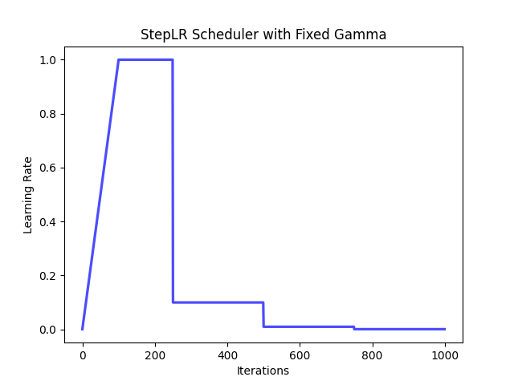
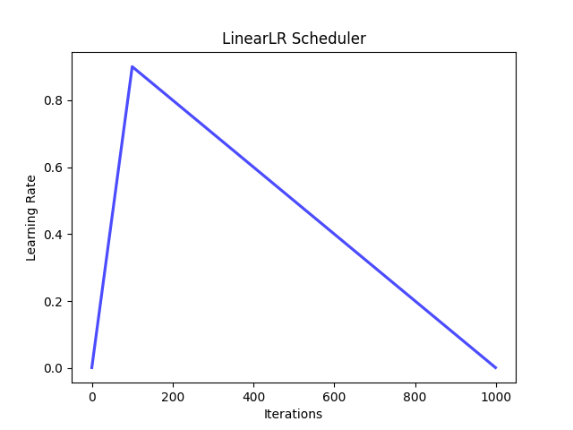

# Customize Training Settings
This document provides a brief tutorials about how to customize training components in detrex.

## Customize LR Scheduler
We've provide a series of commonly used scheduler configs in [common_schedule.py](https://github.com/IDEA-Research/detrex/blob/main/configs/common/common_schedule.py), which is a simple wrapper of fvcore's [ParamSchduler](https://detectron2.readthedocs.io/en/latest/modules/fvcore.html#fvcore.common.param_scheduler.ParamScheduler) for better usage in detrex. Here we provide examples with images to demonstrate the use of these default configurations. The users can also refer to fvcore's [documentation](https://detectron2.readthedocs.io/en/latest/modules/fvcore.html#) for more detailed API reference. Note that **all of the pre-defined scheduler functions return the scheduler config object** in detrex, you should only use it in your own config file and assign it with ``lr_multiplier`` namespace. For configuration, you can refer to [Config System](https://detrex.readthedocs.io/en/latest/tutorials/Config_System.html) for more details.

### MultiStep LR Scheduler
A modified version of multi-step scheduler based on fvcore's [MultiStepParamScheduler](https://detectron2.readthedocs.io/en/latest/modules/fvcore.html#fvcore.common.param_scheduler.MultiStepParamScheduler) which has the same functionality as Pytorch's [MultiStepLR](https://pytorch.org/docs/stable/generated/torch.optim.lr_scheduler.MultiStepLR.html?highlight=multistep#torch.optim.lr_scheduler.MultiStepLR).

**Example:**
```python
from detectron2.config import instantiate
from detrex.config.configs.common.common_schedule import multistep_lr_scheduler

# define `lr_multiplier` config
lr_multiplier = multistep_lr_scheduler(
    values=[1.0, 0.1, 0.01],
    warmup_steps=100,
    num_updates=1000,
    milestones=[600, 900],
    warmup_method="linear",
    warmup_factor=0.001,
)
```
- `values=List[float]`: List of multiplicative factors for learning rate decay.
- `warmup_steps=int`: Learning rate warmup steps.
- `num_updates=int`: The total steps for this scheduler, usually equals to ``train.max_iter``.
- `milestones=List[int]`: List of step indices. Must be increasing.
- `warmup_method=str`: Warmup method, choose from ``{"constant", "linear"}``.
- `warmup_factor=float`: The factor w.r.t the initial value of ``scheduler``.

In this example, the parameter value will increase linearly from 0.001 to 0.1 for steps 0 to 99, and will be 1.0 for steps 100 to 599, 0.1 for steps 600 to 899, and 0.01 for steps 900 to 1000. If we plot this scheduler, it will be looked like:


<details>
<summary> The simple code for visualization </summary>

```python
scheduler = instantiate(lr_multiplier)

x = []
y = []
for i in range(1000):
    x.append(i)
    y.append(scheduler(i/1000))


# Plot the line
plt.plot(x, y, color="blue", alpha=0.7, linewidth=2.3)

# Add labels and title to the plot
plt.xlabel('Iterations')
plt.ylabel('Learning Rate')
plt.title('MultiStep Scheduler')

# Save the plot image
plt.savefig('line_plot.png')
```

</details>

### Step LR Scheduler
A modified version of multi-step scheduler based on fvcore's [StepParamScheduler](https://detectron2.readthedocs.io/en/latest/modules/fvcore.html#fvcore.common.param_scheduler.StepParamScheduler).

**Example:**
```python
from detectron2.config import instantiate
from detrex.config.configs.common.common_schedule import step_lr_scheduler

# define `lr_multiplier` config
lr_multiplier = step_lr_scheduler(
    values=[1.0, 0.5, 0.25, 0.1],
    warmup_steps=100,
    num_updates=1000,
    warmup_method="linear",
    warmup_factor=0.001,
)
```

It will automatically divide the ``num_updates`` into **several equal intervals**, then assign the specified value in ``values`` to each interval according to the index.

In this example, the parameter value will increase linearly from 0.001 to 0.1 for steps 0 to 99, and will be 1.0 for steps 100 to 249, 0.5 for steps 250 to 499, 0.25 for steps 500 to 749 and 0.1 for steps 750 to 1000. If we plot this scheduler, it will be looked like:


### Step LR Scheduler with Fixed Gamma

A modified version of step-lr with fixed gamma based on fvcore's [StepWithFixedGammaParamScheduler](https://detectron2.readthedocs.io/en/latest/modules/fvcore.html#fvcore.common.param_scheduler.StepWithFixedGammaParamScheduler).

**Example:**
```python
from detectron2.config import instantiate
from detrex.config.configs.common.common_schedule import step_lr_scheduler_with_fixed_gamma

# define `lr_multiplier` config
lr_multiplier = step_lr_scheduler_with_fixed_gamma(
    base_value=1.0,
    gamma=0.1,
    num_decays=3,
    num_updates=1000,
    warmup_steps=100,
    warmup_method="linear",
    warmup_factor=0.001,
)
```
- `base_value=float`: The base multiplicative factor.
- `num_decays=int`: The number of times the multiplicative factor decays.
- `num_updates=int`: The total steps for this scheduler, usually equals to ``train.max_iter``.

In this example, num_updates will be splited into `num_decays + 1 = 4` parts as `[0, 250), [250, 500), [500, 750), [750, 1000)`. And the parameter value will increase linearly from 0.001 to 0.1 for steps 0 to 99, and will be `1.0` for steps 100 to 249, `1.0 * 0.1 = 0.1` for steps 250 to 499, `0.1 * 0.1 = 0.01` for steps 500 to 749 and `0.01 * 0.1 = 0.001` for steps 750 to 1000. If we plot this scheduler, it will be looked like:




### Cosine LR Scheduler

A modified version of cosine-lr based on fvcore's [CosineParamScheduler](https://detectron2.readthedocs.io/en/latest/modules/fvcore.html#fvcore.common.param_scheduler.CosineParamScheduler).

**Example:**
```python
from detectron2.config import instantiate
from detrex.config.configs.common.common_schedule import cosine_lr_scheduler, linear_lr_scheduler

# define `lr_multiplier` config
lr_multiplier = cosine_lr_scheduler(
    start_value=1.0,
    end_value=0.0001,
    warmup_steps=100,
    num_updates=1000,
    warmup_method="linear",
    warmup_factor=0.001,
)
```

In this example, the parameter will increase linearly from 0.001 to the highest value and then decrease cosinely to 0.0001 in 100 to 1000 steps. If we plot this scheduler, it will be looked like:


### Linear LR Scheduler
A modified version of linear-lr based on fvcore's [LinearParamScheduler](https://detectron2.readthedocs.io/en/latest/modules/fvcore.html#fvcore.common.param_scheduler.LinearParamScheduler).

**Example:**
```python
from detectron2.config import instantiate
from detrex.config.configs.common.common_schedule import cosine_lr_scheduler, linear_lr_scheduler

# define `lr_multiplier` config
lr_multiplier = linear_lr_scheduler(
    start_value=1.0,
    end_value=0.0001,
    warmup_steps=100,
    num_updates=1000,
    warmup_method="linear",
    warmup_factor=0.001,
)
```

In this example, the parameter will increase linearly from 0.001 to the highest value and then decrease linearly to 0.0001 in 100 to 1000 steps. If we plot this scheduler, it will be looked like:




### ExponentialLR Scheduler
A modified version of linear-lr based on fvcore's [ExponentialParamScheduler](https://detectron2.readthedocs.io/en/latest/modules/fvcore.html#fvcore.common.param_scheduler.ExponentialParamScheduler).

**Example:**
```python
from detectron2.config import instantiate
from detrex.config.configs.common.common_schedule import exponential_lr_scheduler

# define `lr_multiplier` config
lr_multiplier = exponential_lr_scheduler(
    start_value=1.0,
    decay=0.02,
    warmup_steps=100,
    num_updates=1000,
    warmup_method="linear",
    warmup_factor=0.001,
)
```

In this example, the parameter will increase linearly from 0.001 to the highest value and then decrease exponentially with 0.02 ratio in 100 to 1000 steps. If we plot this scheduler, it will be looked like:


