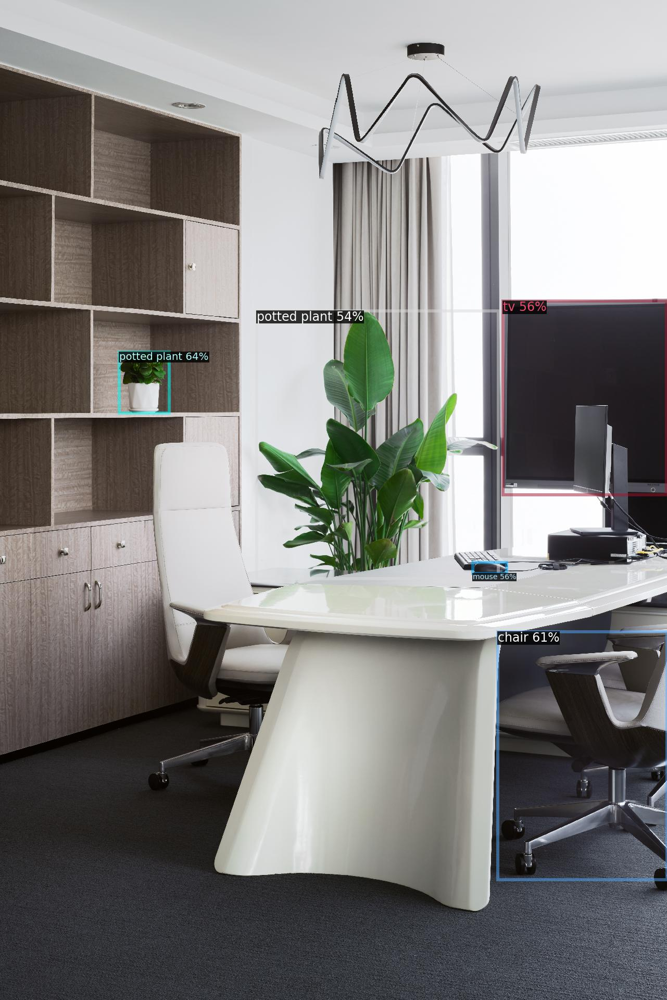

# Installation
**detrex** provides an editable installation way for you to develop your own project based on detrex's framework.

## Requirements
- Linux with Python ≥ **3.7**
- PyTorch ≥ **1.10** and [torchvision](https://github.com/pytorch/vision/) matches the PyTorch insallation. Install them following the official instructions from [pytorch.org](https://pytorch.org) to make sure of this.


## Build detrex from Source
gcc & g++ ≥ 5.4 are required as [detectron2](https://github.com/facebookresearch/detectron2), [ninja](https://ninja-build.org/) is optional but recommended for faster build. After having them, install detrex as follows:

- Firstly, create a conda virtual environment named `detrex` and activate it
```bash
$ conda create -n detrex python=3.7 -y
$ conda activate detrex
```
- Secondly, clone `detrex` and initialize the `detectron2` submodule.
```bash
$ git clone https://github.com/IDEA-Research/detrex.git
$ cd detrex
$ git submodule init
$ git submodule update
```
- Finally, install `detectron2` and build an editable version of `detrex` for better usage.

```bash
$ python -m pip install -e detectron2
$ pip install -e .
```

- To **rebuild** detrex that's built from a local clone, use `rm -rf build/` to clean the old build first.
- To ensure proper installation of the customized CUDA operator, make sure your environment has the [CUDA runtime](https://developer.nvidia.com/cuda-downloads) correctly installed and verify that the `CUDA_HOME` **environment parameter** is set to the `CUDA` dir. If not, you can manually set it using the command `export CUDA_HOME=/usr/local/cuda-11.3` (this is just an example).

## Verify the installation
To verify whether detrex is installed correctly, we provide some sample codes for users to run an inference demo to confirm it. Note that if you've not installed CUDA operator (e.g. `MultiScaleDeformableAttention`) correctly, You can still train the model that does not use the customized CUDA operator (e.g. `DAB-DETR`, `DN-DETR`, etc).

**Step 1.** Download the pretrained weights and demo image.
```bash
cd detrex

# download pretrained DAB-DETR model
wget https://github.com/IDEA-Research/detrex-storage/releases/download/v0.1.0/dab_detr_r50_50ep.pth

# download pretrained DINO model
wget https://github.com/IDEA-Research/detrex-storage/releases/download/v0.2.1/dino_r50_4scale_12ep.pth

# download the demo image
wget https://github.com/IDEA-Research/detrex-storage/releases/download/v0.2.1/idea.jpg
```

**Step 2.** Verify the inference demo.

Option (a). Inference pretrained weights on demo image.
```bash
python demo/demo.py --config-file projects/dab_detr/configs/dab_detr_r50_50ep.py \
                    --input "./idea.jpg" \
                    --output "./demo_output.jpg" \
                    --opts train.init_checkpoint="./dab_detr_r50_50ep.pth"
```
You can check the `demo_output.jpg` and see the detected objects on chair, plants, etc.

To verify if the customized CUDA operator is correctly installed, you can inference the demo image with DINO pretrained weights as:
```bash
python demo/demo.py --config-file projects/dino/configs/dino-resnet/dino_r50_4scale_12ep.py \
                    --input "./idea.jpg" \
                    --output "./demo_output.jpg" \
                    --opts train.init_checkpoint="./dino_r50_4scale_12ep.pth"
```

The visualization results will be like:



Option (b): You can also verify the inference results on standard dataset like **COCO 2017 `val`**:

To evaluate `DAB-DETR` using single node with 4 gpus:
```bash
export DETECTRON2_DATASETS=/path/to/datasets

python tools/train_net.py --config-file projects/dab_detr/configs/dab_detr_r50_50ep.py \
                          --num-gpus 4 \
                          --eval-only \
                          train.init_checkpoint="./dab_detr_r50_50ep.pth"
```

Expected results:

```bash
Evaluation results for bbox:
|   AP   |  AP50  |  AP75  |  APs   |  APm   |  APl   |
|:------:|:------:|:------:|:------:|:------:|:------:|
| 43.277 | 63.895 | 45.884 | 23.399 | 47.059 | 62.113 |
```

To evaluate `DINO` using single node with 4 gpus:

```bash
export DETECTRON2_DATASETS=/path/to/datasets

python tools/train_net.py --config-file projects/dino/configs/dino_r50_4scale_12ep.py \
                          --num-gpus 4 \
                          --eval-only \
                          train.init_checkpoint="./dino_r50_4scale_12ep.pth"
```

Expected results:

```bash
Evaluation results for bbox:
|   AP   |  AP50  |  AP75  |  APs   |  APm   |  APl   |
|:------:|:------:|:------:|:------:|:------:|:------:|
| 49.193 | 66.649 | 53.800 | 32.295 | 52.485 | 63.567 |
```

## Common Installation Issues
If you meet some installation problems with `detectron2`, please see [detectron2 installation issues](https://detectron2.readthedocs.io/en/latest/tutorials/install.html#common-installation-issues) for more details.

Click each issue for its solutions:
<details>
<summary> NotImplementedError: Cuda is not availabel </summary>

If you're running with `slurm`, make sure that [CUDA runtime](https://developer.nvidia.com/cuda-downloads) has been installed. Please specify the environment `CUDA_HOME` to the path of `CUDA` dir, e.g., `CUDA_HOME=/usr/local/cuda-11.3` which is the default path to the installed CUDA runtime.

</details>

