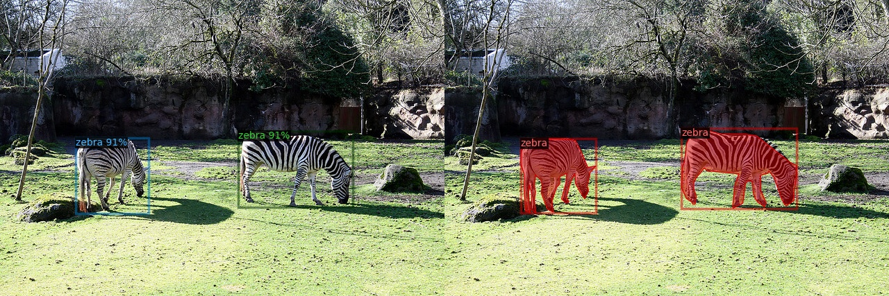

# Practical Tools and Scripts
Apart from training and evaluation scripts, detrex also provides lots of practical tools under [tools/](https://github.com/IDEA-Research/detrex/tree/main/tools) directory or useful scripts.

## Tensorboard Log Analysis
`detrex` automatically saves tensorboard logs in `cfg.train.output_dir`, users can directly analyze the training logs using:

```bash
tensorboard --logdir /path/to/cfg.train.output_dir
```


## Model Analysis
Analysis tool for FLOPs, parameters, activations of detrex models.

- Analyze FLOPs

```bash
cd detrex
python tools/analyze_model.py --num-inputs 100 \
                              --tasks flop \
                              --config-file /path/to/config.py \
                              train.init_checkpoint=/path/to/model.pkl
```

- Analyze parameters

```bash
cd detrex
python tools/analyze_model.py --tasks parameter \
                              --config-file /path/to/config.py \
```

- Analyze activations

```bash
cd detrex
python tools/analyze_model.py --num-inputs 100 \
                              --tasks activation \
                              --config-file /path/to/config.py \
                              train.init_checkpoint=/path/to/model.pkl
```

- Analyze model structure

```bash
cd detrex
python tools/analyze_model.py --tasks structure \
                              --config-file /path/to/config.py \
```

## Visualization
Here are some useful tools for visualizing the model predictions or dataset.

### Visualize Predictions
To visualize the json instance detection/segmentation results dumped by `COCOEvaluator`, you should firstly specify the `output_dir` args for `Evaluator` in your config files, default to `None` in detrex.

```python
# your config.py
dataloader = get_config("common/data/coco_detr.py").dataloader

# dump the testing results into output_dir for visualization
# save in the same directory as training logs
dataloader.evaluator.output_dir = /path/to/dir
```

Then run the following scripts:
```bash
python tools/visualize_json_results.py --input /path/to/x.json \  # path to the saved testing results
                                       --output dir/ \
                                       --dataset coco_2017_val
```

And the visualization results will be saved in `dir/`, here's the example of `DINO-R50-4Scale-12epoch` prediction results:



### Visualize Datasets
