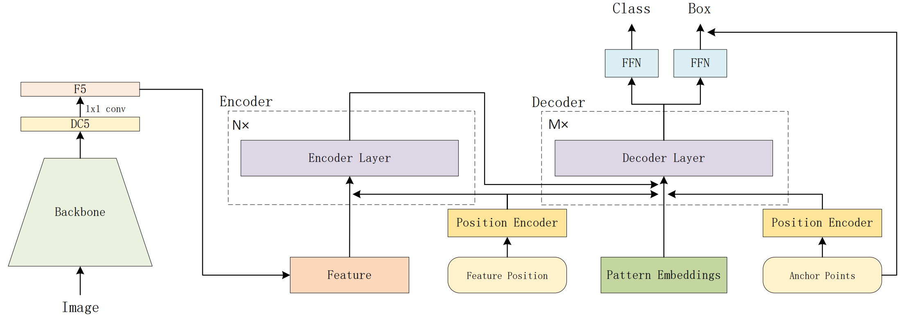

## Anchor DETR: Query Design for Transformer-Based Object Detection

Yingming Wang, Xiangyu Zhang, Tong Yang, Jian Sun

[[`arXiv`](https://arxiv.org/abs/2109.07107)] [[`BibTeX`](#citing-anchor-detr)]

<div align="center">
  
</div><br/>

We reproduce DETR in detrex based on [Detectron2 wrapper for DETR](https://github.com/facebookresearch/detr/tree/main/d2).

## Converted Weights
Here we provides the weights which are converted by [converter.py](./converter.py) from the official DETR repo.

<table><tbody>
<!-- START TABLE -->
<!-- TABLE HEADER -->
<th valign="bottom">Name</th>
<th valign="bottom">Backbone</th>
<th valign="bottom">Pretrain</th>
<th valign="bottom">Epochs</th>
<th valign="bottom">box<br/>AP</th>
<th valign="bottom">download</th>
<!-- TABLE BODY -->
<!-- ROW: detr_r50 -->
 <tr><td align="left"><a href="configs/detr_r50_300ep.py">DETR-R50</a></td>
<td align="center">R-50</td>
<td align="center">IN1k</td>
<td align="center">500</td>
<td align="center">42.0</td>
<td align="center"> <a href="https://github.com/IDEA-Research/detrex-storage/releases/download/v0.1.0/converted_detr_r50_500ep.pth">model</a></td>
</tr>
<!-- ROW: detr_r50_dc5 -->
 <tr><td align="left"><a href="configs/detr_r50_dc5_300ep.py">DETR-R50-DC5</a></td>
<td align="center">R-50</td>
<td align="center">IN1k</td>
<td align="center">500</td>
<td align="center">43.4</td>
<td align="center"> <a href="https://github.com/IDEA-Research/detrex-storage/releases/download/v0.3.0/converted_detr_r50_dc5.pth">model</a></td>
</tr>
<!-- ROW: detr_r101 -->
 <tr><td align="left"><a href="configs/detr_r101_300ep.py">DETR-R101</a></td>
<td align="center">R-101</td>
<td align="center">IN1k</td>
<td align="center">500</td>
<td align="center">43.5</td>
<td align="center"> <a href="https://github.com/IDEA-Research/detrex-storage/releases/download/v0.1.0/converted_detr_r101_500ep.pth">model</a></td>
</tr>
<!-- ROW: detr_r101_dc5 -->
 <tr><td align="left"><a href="configs/detr_r101_dc5_300ep.py">DETR-R101-DC5</a></td>
<td align="center">R-101</td>
<td align="center">IN1k</td>
<td align="center">500</td>
<td align="center">44.9</td>
<td align="center"> <a href="https://github.com/IDEA-Research/detrex-storage/releases/download/v0.3.0/converted_detr_r101_dc5.pth">model</a></td>
</tr>
</tbody></table>

**Note:** Here we borrowed the pretrained weight from [DETR](https://github.com/facebookresearch/detr) official repo. And our detrex training results will be released in the future version.

## Training
Training DETR model for 300 epochs:
```bash
cd detrex
python tools/train_net.py --config-file projects/detr/configs/detr_r50_300ep.py --num-gpus 8
```
By default, we use 8 GPUs with total batch size as 64 for training.

## Evaluation
Model evaluation can be done as follows:
```bash
cd detrex
python tools/train_net.py --config-file projects/detr/configs/path/to/config.py \
    --eval-only train.init_checkpoint=/path/to/model_checkpoint
```

## Evaluating the official DETR model
Using the modified conversion script to convert models trained by the official [DETR](https://github.com/facebookresearch/detr) training loop into the format of detrex model. To download and evaluate `DETR-R50` model, simply run:
```bash
cd detrex
python projects/detr/converter.py \
    --source_model https://dl.fbaipublicfiles.com/detr/detr-r50-e632da11.pth \
    --output_model converted_detr_r50_model.pth
```
Then evaluate the converted model like:
```bash
python tools/train_net.py --config-file projects/detr/configs/detr_r50_300ep.py \
    --eval-only train.init_checkpoint="./converted_detr_r50_model.pth"
```

## Citing Anchor-DETR
```BibTex
@inproceedings{wang2022anchor,
  title={Anchor detr: Query design for transformer-based detector},
  author={Wang, Yingming and Zhang, Xiangyu and Yang, Tong and Sun, Jian},
  booktitle={Proceedings of the AAAI Conference on Artificial Intelligence},
  volume={36},
  number={3},
  pages={2567--2575},
  year={2022}
}
```