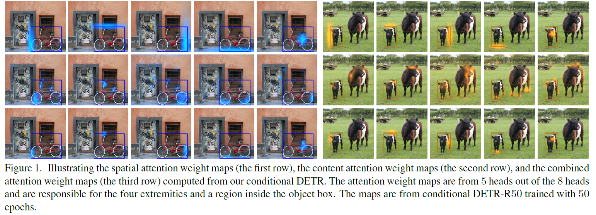

## Conditional DETR for Fast Training Convergence

Depu Meng, Xiaokang Chen, Zejia Fan, Gang Zeng, Houqiang Li, Yuhui Yuan, Lei Sun, Jingdong Wang

[[`arXiv`](https://arxiv.org/abs/2108.06152)] [[`BibTeX`](#citing-conditional-detr)]

<div align="center">
  
</div><br/>

## Pretrained Models
<table><tbody>
<!-- START TABLE -->
<!-- TABLE HEADER -->
<th valign="bottom">Name</th>
<th valign="bottom">Backbone</th>
<th valign="bottom">Pretrain</th>
<th valign="bottom">box<br/>AP</th>
<th valign="bottom">download</th>
<!-- TABLE BODY -->
<!-- ROW: dab_detr_r50_50ep -->
 <tr><td align="left"><a href="configs/dab_detr_r50_50ep.py">Conditional DETR-R50</a></td>
<td align="center">R-50</td>
<td align="center">IN1k</td>
<td align="center">43.2</td>
<td align="center"> <a href="">Google Drive</a></td>
</tr>
</tbody></table>

**Note:** DC5 means using dilated convolution in `res5`.


## Training
All configs can be trained with:
```bash
cd detrex
python tools/train_net.py --config-file projects/conditional_detr/configs/path/to/config.py --num-gpus 8
```
By default, we use 8 GPUs with total batch size as 16 for training.

## Evaluation
Model evaluation can be done as follows:
```bash
cd detrex
python tools/train_net.py --config-file projects/conditional_detr/configs/path/to/config.py --eval-only train.init_checkpoint=/path/to/model_checkpoint
```

## Citing Conditional-DETR
If you find our work helpful for your research, please consider citing the following BibTeX entry.

```BibTex
@inproceedings{meng2021-CondDETR,
  title       = {Conditional DETR for Fast Training Convergence},
  author      = {Meng, Depu and Chen, Xiaokang and Fan, Zejia and Zeng, Gang and Li, Houqiang and Yuan, Yuhui and Sun, Lei and Wang, Jingdong},
  booktitle   = {Proceedings of the IEEE International Conference on Computer Vision (ICCV)},
  year        = {2021}
}
```
