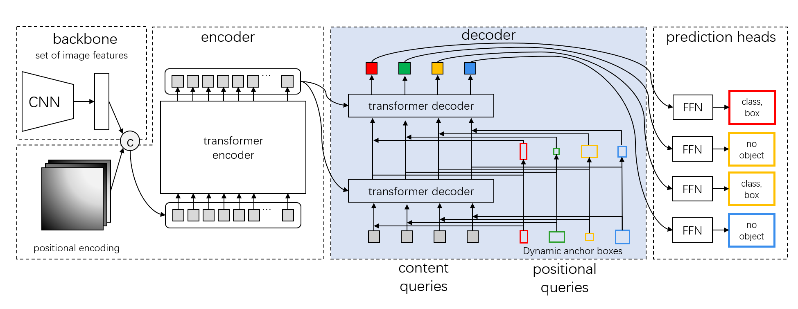

## DAB-Deformable-DETR

Implement `DAB-Deformable-DETR` which is a strong baseline of [DAB-DETR: Dynamic Anchor Boxes are Better Queries for DETR](https://arxiv.org/abs/2201.12329).

[[`arXiv`](https://arxiv.org/abs/2201.12329)] [[`BibTeX`](#citing-dab-detr)]

<div align="center">
  
</div><br/>

## Pretrained Models
Here we provide the pretrained `DAB-Deformable-DETR` weights based on detrex.
<table><tbody>
<!-- START TABLE -->
<!-- TABLE HEADER -->
<th valign="bottom">Name</th>
<th valign="bottom">Backbone</th>
<th valign="bottom">Pretrain</th>
<th valign="bottom">Epochs</th>
<th valign="bottom">box<br/>AP</th>
<th valign="bottom">download</th>
<!-- TABLE BODY -->
<!-- ROW: dab_deformable_detr_r50_50ep -->
 <tr><td align="left"><a href="configs/dab_deformable_detr_r50_50ep.py">DAB-Deformable-DETR-R50</a></td>
<td align="center">R-50</td>
<td align="center">IN1k</td>
<td align="center">50</td>
<td align="center">49.0</td>
<td align="center"> <a href="https://github.com/IDEA-Research/detrex-storage/releases/download/v0.2.0/dab_deformable_detr_r50_50ep_49AP.pth">model</a></td>
</tr>
<!-- ROW: dab_deformable_detr_r50_two_stage_50ep -->
 <tr><td align="left"><a href="configs/dab_deformable_detr_r50_two_stage_50ep.py">DAB-Deformable-DETR-R50-Two-Stage</a></td>
<td align="center">R-50</td>
<td align="center">IN1k</td>
<td align="center">50</td>
<td align="center">49.7</td>
<td align="center"> <a href="https://github.com/IDEA-Research/detrex-storage/releases/download/v0.2.0/dab_deformable_detr_r50_two_stage_49_7AP.pth">model</a></td>
</tr>
</tbody></table>


## Training
All configs can be trained with:
```bash
cd detrex
python tools/train_net.py --config-file projects/dab_deformable_detr/configs/path/to/config.py --num-gpus 8
```
By default, we use 8 GPUs with total batch size as 16 for training.

## Evaluation
Model evaluation can be done as follows:
```bash
cd detrex
python tools/train_net.py --config-file projects/dab_deformable_detr/configs/path/to/config.py --eval-only train.init_checkpoint=/path/to/model_checkpoint
```

## Citing DAB-DETR
If you find our work helpful for your research, please consider citing the following BibTeX entry.

```BibTex
@inproceedings{
      liu2022dabdetr,
      title={{DAB}-{DETR}: Dynamic Anchor Boxes are Better Queries for {DETR}},
      author={Shilong Liu and Feng Li and Hao Zhang and Xiao Yang and Xianbiao Qi and Hang Su and Jun Zhu and Lei Zhang},
      booktitle={International Conference on Learning Representations},
      year={2022},
      url={https://openreview.net/forum?id=oMI9PjOb9Jl}
}
```
