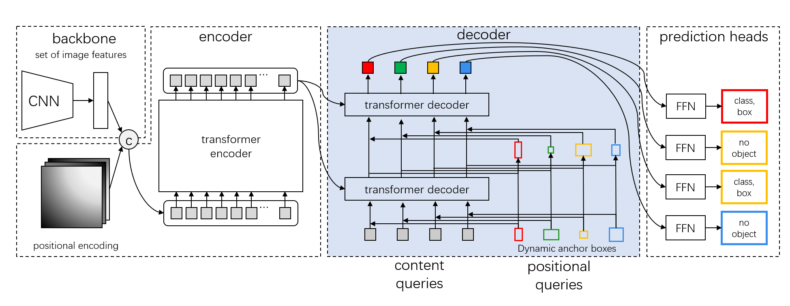

## DAB-DETR: Dynamic Anchor Boxes are Better Queries for DETR

Shilong Liu, Feng Li, Hao Zhang, Xiao Yang, Xianbiao Qi, Hang Su, Jun Zhu, Lei Zhang

[[`arXiv`](https://arxiv.org/abs/2201.12329)] [[`BibTeX`](#citing-dab-detr)]

<div align="center">
  
</div><br/>

## Pretrained Models
Here we provide the pretrained `DAB-DETR` weights based on detrex.
<table><tbody>
<!-- START TABLE -->
<!-- TABLE HEADER -->
<th valign="bottom">Name</th>
<th valign="bottom">Backbone</th>
<th valign="bottom">Pretrain</th>
<th valign="bottom">Epochs</th>
<th valign="bottom">box<br/>AP</th>
<th valign="bottom">download</th>
<!-- TABLE BODY -->
<!-- ROW: dab_detr_r50_50ep -->
 <tr><td align="left"><a href="configs/dab_detr_r50_50ep.py">DAB-DETR-R50</a></td>
<td align="center">R-50</td>
<td align="center">IN1k</td>
<td align="center">50</td>
<td align="center">43.3</td>
<td align="center"> <a href="https://github.com/IDEA-Research/detrex-storage/releases/download/v0.1.0/dab_detr_r50_50ep.pth">model</a></td>
</tr>
<!-- ROW: dab_detr_r101_50ep -->
 <tr><td align="left"><a href="configs/dab_detr_r101_50ep.py">DAB-DETR-R101</a></td>
<td align="center">R-101</td>
<td align="center">IN1k</td>
<td align="center">50</td>
<td align="center">44.0</td>
<td align="center"> <a href="https://github.com/IDEA-Research/detrex-storage/releases/download/v0.1.0/dab_detr_r101_50ep.pth">model</a></td>
</tr>
<!-- ROW: dab_detr_swin_t_in1k_50ep -->
 <tr><td align="left"><a href="configs/dab_detr_swin_t_in1k_50ep.py">DAB-DETR-Swin-T</a></td>
<td align="center">Swin-T</td>
<td align="center">IN1k</td>
<td align="center">50</td>
<td align="center">45.2</td>
<td align="center"> <a href="https://github.com/IDEA-Research/detrex-storage/releases/download/v0.1.0/dab_detr_swin_t_in1k_50ep.pth">model</a></td>
</tr>
</tbody></table>


## Converted Models
Here are the converted the pretrained weights from [DAB-DETR](https://github.com/IDEA-Research/DAB-DETR) official repo.
<table><tbody>
<!-- START TABLE -->
<!-- TABLE HEADER -->
<th valign="bottom">Name</th>
<th valign="bottom">Backbone</th>
<th valign="bottom">Pretrain</th>
<th valign="bottom">Epochs</th>
<th valign="bottom">box<br/>AP</th>
<th valign="bottom">download</th>
<!-- TABLE BODY -->
<!-- ROW: dab_detr_r50_dc5_50ep -->
 <tr><td align="left"><a href="configs/dab_detr_r50_dc5_50ep.py">DAB-DETR-R50-DC5</a></td>
<td align="center">R-50</td>
<td align="center">IN1k</td>
<td align="center">50</td>
<td align="center">44.6</td>
<td align="center"> <a href="">model</a></td>
</tr>
</tbody></table>

## Training
All configs can be trained with:
```bash
cd detrex
python tools/train_net.py --config-file projects/dab_detr/configs/path/to/config.py --num-gpus 8
```
By default, we use 8 GPUs with total batch size as 16 for training.

## Evaluation
Model evaluation can be done as follows:
```bash
cd detrex
python tools/train_net.py --config-file projects/dab_detr/configs/path/to/config.py --eval-only train.init_checkpoint=/path/to/model_checkpoint
```

## Citing DAB-DETR
If you find our work helpful for your research, please consider citing the following BibTeX entry.

```BibTex
@inproceedings{
      liu2022dabdetr,
      title={{DAB}-{DETR}: Dynamic Anchor Boxes are Better Queries for {DETR}},
      author={Shilong Liu and Feng Li and Hao Zhang and Xiao Yang and Xianbiao Qi and Hang Su and Jun Zhu and Lei Zhang},
      booktitle={International Conference on Learning Representations},
      year={2022},
      url={https://openreview.net/forum?id=oMI9PjOb9Jl}
}
```
