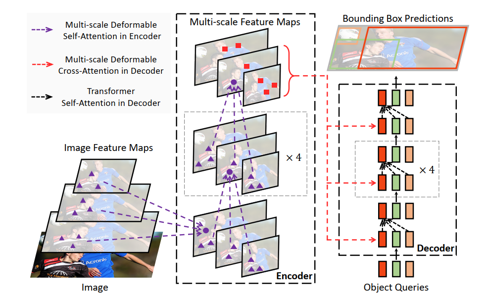

## Deformable DETR: Deformable Transformers for End-to-End Object Detection

Xizhou Zhu, Weijie Su, Lewei Lu, Bin Li, Xiaogang Wang, Jifeng Dai

[[`arXiv`](https://arxiv.org/abs/2010.04159)] [[`BibTeX`](#citing-deformable-detr)]


<div align="center">
  
</div><br/>

## Converted Weights
<table><tbody>
<!-- START TABLE -->
<!-- TABLE HEADER -->
<th valign="bottom">Name</th>
<th valign="bottom">Backbone</th>
<th valign="bottom">Pretrain</th>
<th valign="bottom">Epochs</th>
<th valign="bottom">box<br/>AP</th>
<th valign="bottom">download</th>
<!-- TABLE BODY -->
<!-- ROW: deformable_detr_r50_50ep -->
 <tr><td align="left"><a href="configs/deformable_detr_r50_50ep.py">Deformable-DETR-R50</a></td>
<td align="center">R-50</td>
<td align="center">IN1k</td>
<td align="center">50</td>
<td align="center">44.59</td>
<td align="center"> <a href="">model</a></td>
</tr>
<!-- ROW: deformable_detr_r50_with_box_refinement -->
 <tr><td align="left"><a href="configs/deformable_detr_r50_with_box_refinement_50ep.py">Deformable-DETR-R50-Box-Refinement</a></td>
<td align="center">R-50</td>
<td align="center">IN1k</td>
<td align="center">50</td>
<td align="center">46.28</td>
<td align="center"> <a href="">model</a></td>
</tr>
<!-- ROW: deformable_detr_r50_two_stage -->
 <tr><td align="left"><a href="configs/deformable_detr_r50_two_stage_50ep.py">Deformable-DETR-R50-Two-Stage</a></td>
<td align="center">R-50</td>
<td align="center">IN1k</td>
<td align="center">50</td>
<td align="center"></td>
<td align="center"> <a href="">model</a></td>
</tr>
</tbody></table>

**Note:** Here we borrowed the pretrained weight from [Deformable-DETR](https://github.com/fundamentalvision/Deformable-DETR) official repo. And our detrex training results will be released in the future version.

## Training
All configs can be trained with:
```bash
cd detrex
python tools/train_net.py --config-file projects/deformable_detr/configs/path/to/config.py --num-gpus 8
```
By default, we use 8 GPUs with total batch size as 16 for training.

## Evaluation
Model evaluation can be done as follows:
```bash
cd detrex
python tools/train_net.py --config-file projects/deformable_detr/configs/path/to/config.py --eval-only train.init_checkpoint=/path/to/model_checkpoint
```

## Citing Deformable-DETR
```BibTex
@article{zhu2020deformable,
  title={Deformable DETR: Deformable Transformers for End-to-End Object Detection},
  author={Zhu, Xizhou and Su, Weijie and Lu, Lewei and Li, Bin and Wang, Xiaogang and Dai, Jifeng},
  journal={arXiv preprint arXiv:2010.04159},
  year={2020}
}
```