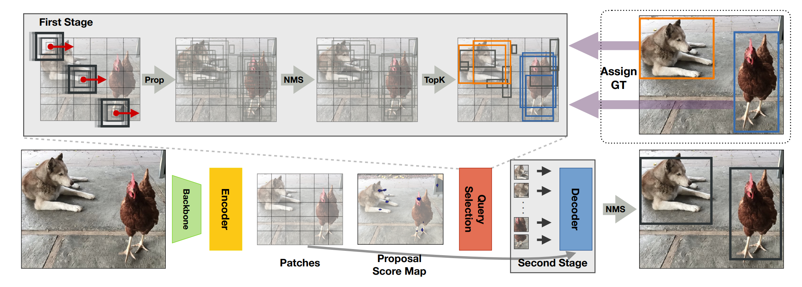

## NMS strikes back

Jeffrey Ouyang-Zhang, Jang Hyun Cho, Xingyi Zhou, Philipp Krähenbühl

[[`arXiv`](https://arxiv.org/abs/2212.06137)] [[`BibTeX`](#citing-deta)]

<div align="center">
  
</div><br/>

## Pretrained Weights
Here we provide our pretrained DETA model based on detrex.
<table><tbody>
<!-- START TABLE -->
<!-- TABLE HEADER -->
<th valign="bottom">Name</th>
<th valign="bottom">Backbone</th>
<th valign="bottom">Pretrain</th>
<th valign="bottom">Epochs</th>
<th valign="bottom">box<br/>AP</th>
<th valign="bottom">download</th>
<!-- TABLE BODY -->
 <tr><td align="left"><a href="configs/deta_r50_5scale_12ep.py">DETA-R50-5scale-12ep (bs=1)</a></td>
<td align="center">R-50</td>
<td align="center">IN1k</td>
<td align="center">12</td>
<td align="center">50.0</td>
<td align="center"> <a href="https://github.com/IDEA-Research/detrex-storage/releases/download/v0.4.0/deta_r50_5scale_12ep_bs8.pth">model</a></td>
</tr>
</tbody></table>

- For training DETA model with `batch_size=1` for each gpu. We recommend to use the default [train_net.py](https://github.com/IDEA-Research/detrex/blob/main/tools/train_net.py) to reproduce the results.
- We also align the training hyper-param in the modified [train_net.py](./train_net.py) by hacking the optimizer.

**Notable facts and caveats**: Using detrex default trainer with `optim.lr=1e-4`, it's better to train DETA model with `dataloader.train.total_batch_size=8` for 180000 iters, which can achieve 50.0 AP. However, with batch=16 for 90000 iters may only get 49.4AP, we guess the different hyper-param between our implementation and the official repo may influence the results.

## Converted Weights
<table><tbody>
<!-- START TABLE -->
<!-- TABLE HEADER -->
<th valign="bottom">Name</th>
<th valign="bottom">Backbone</th>
<th valign="bottom">Pretrain</th>
<th valign="bottom">Epochs</th>
<th valign="bottom">box<br/>AP</th>
<th valign="bottom">download</th>
<!-- TABLE BODY -->
 <tr><td align="left"><a href="configs/improved_deformable_detr_baseline_50ep.py">Improved-Deformable-DETR-R50-50ep</a></td>
<td align="center">R-50</td>
<td align="center">IN1k</td>
<td align="center">50</td>
<td align="center">49.8</td>
<td align="center"> <a href="https://github.com/IDEA-Research/detrex-storage/releases/download/v0.3.0/converted_deta_improved_deformable_baseline.pth">model</a></td>
</tr>
 <tr><td align="left"><a href="configs/deta_r50_5scale_12ep.py">DETA-R50-5scale-12ep</a></td>
<td align="center">R-50</td>
<td align="center">IN1k</td>
<td align="center">12</td>
<td align="center">50.1</td>
<td align="center"> <a href="https://github.com/IDEA-Research/detrex-storage/releases/download/v0.3.0/converted_deta_r50_5scale_12ep.pth">model</a></td>
</tr>
 <tr><td align="left"><a href="configs/deta_r50_5scale_12ep.py">DETA-Swin-Large-finetune</a></td>
<td align="center">Swin-Large-384</td>
<td align="center">IN1k</td>
<td align="center">24</td>
<td align="center">62.9</td>
<td align="center"> <a href="https://github.com/IDEA-Research/detrex-storage/releases/download/v0.3.0/converted_deta_swin_o365_finetune.pth">model</a></td>
</tr>
</tbody></table>

**Note:** Here we borrowed the pretrained weight from [DETA](https://github.com/jozhang97/DETA) official repo. And our detrex training results will be released in the future version.

## Training
Training DETA-R50 model:
```bash
cd detrex
python tools/train_net.py --config-file projects/anchor_detr/configs/anchor_detr_r50_50ep.py --num-gpus 8
```
By default, we use 8 GPUs with total batch size as 64 for training.

## Evaluation
Model evaluation can be done as follows:
```bash
cd detrex
python tools/train_net.py --config-file projects/deta/configs/path/to/config.py \
    --eval-only train.init_checkpoint=/path/to/model_checkpoint
```


## Citing DETA
```BibTex
@article{ouyangzhang2022nms,
  title={NMS Strikes Back},
  author={Ouyang-Zhang, Jeffrey and Cho, Jang Hyun and Zhou, Xingyi and Kr{\"a}henb{\"u}hl, Philipp},
  journal={arXiv preprint arXiv:2212.06137},
  year={2022}
}
```