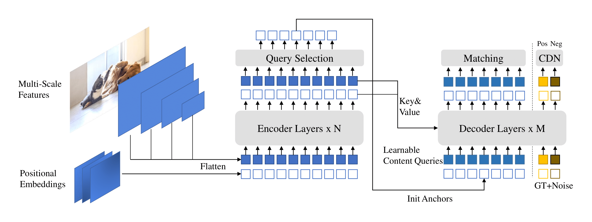

## DINO: DETR with Improved DeNoising Anchor Boxes for End-to-End Object Detection

Hao Zhang, Feng Li, Shilong Liu, Lei Zhang, Hang Su, Jun Zhu, Lionel M. Ni, Heung-Yeung Shum

[[`arXiv`](https://arxiv.org/abs/2203.03605)] [[`BibTeX`](#citing-dino)]

<div align="center">
  
</div><br/>


## Training
All configs can be trained with:
```bash
cd detrex
python tools/train_net.py --config-file projects/dino/configs/path/to/config.py --num-gpus 8
```
By default, we use 8 GPUs with total batch size as 16 for training.

## Evaluation
Model evaluation can be done as follows:
```bash
cd detrex
python tools/train_net.py --config-file projects/dino/configs/path/to/config.py --eval-only train.init_checkpoint=/path/to/model_checkpoint
```


## Citing DINO
If you find our work helpful for your research, please consider citing the following BibTeX entry.

```BibTex
@misc{zhang2022dino,
      title={DINO: DETR with Improved DeNoising Anchor Boxes for End-to-End Object Detection}, 
      author={Hao Zhang and Feng Li and Shilong Liu and Lei Zhang and Hang Su and Jun Zhu and Lionel M. Ni and Heung-Yeung Shum},
      year={2022},
      eprint={2203.03605},
      archivePrefix={arXiv},
      primaryClass={cs.CV}
}
```