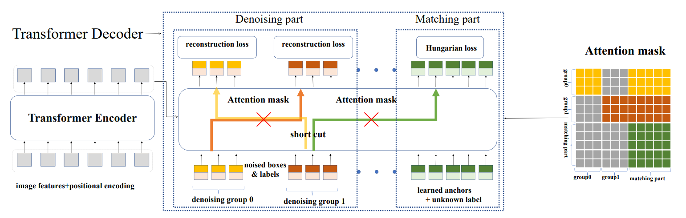

## DN-Deformable-DETR

Implement `DN-Deformable-DETR` which is a strong baseline of [DN-DETR: Accelerate DETR Training by Introducing Query DeNoising](https://arxiv.org/abs/2203.01305) build on top of [DAB-Deformable-DETR](../dab_deformable_detr/)

[[`arXiv`](https://arxiv.org/abs/2201.12329)] [[`BibTeX`](#citing-dn-detr)]

<div align="center">
  
</div><br/>

## Converted Weights
<table><tbody>
<!-- START TABLE -->
<!-- TABLE HEADER -->
<th valign="bottom">Name</th>
<th valign="bottom">Backbone</th>
<th valign="bottom">Pretrain</th>
<th valign="bottom">Epochs</th>
<th valign="bottom">box<br/>AP</th>
<th valign="bottom">download</th>
<!-- TABLE BODY -->
<!-- ROW: dn_deformable_detr_r50_50ep -->
 <tr><td align="left"><a href="configs/dn_deformable_detr_r50_50ep.py">DN-Deformable-DETR-R50</a></td>
<td align="center">R-50</td>
<td align="center">IN1k</td>
<td align="center">50</td>
<td align="center">49.51</td>
<td align="center"> <a href="https://github.com/IDEA-Research/detrex-storage/releases/download/v0.1.0/converted_dn_deformable_detr_r50_50ep.pth">model</a></td>
</tr>
</tbody></table>

**Note:** Here we converted the pretrained weight from [DN-DETR](https://github.com/IDEA-Research/DN-DETR) official repo. And our detrex training results will be released in the future version.

## Training
All configs can be trained with:
```bash
cd detrex
python tools/train_net.py --config-file projects/dn_deformable_detr/configs/path/to/config.py --num-gpus 8
```
By default, we use 8 GPUs with total batch size as 16 for training.

## Evaluation
Model evaluation can be done as follows:
```bash
cd detrex
python tools/train_net.py --config-file projects/dn_deformable_detr/configs/path/to/config.py --eval-only train.init_checkpoint=/path/to/model_checkpoint
```

## Citing DN-DETR
If you find our work helpful for your research, please consider citing the following BibTeX entry.

```BibTex
@inproceedings{li2022dn,
      title={Dn-detr: Accelerate detr training by introducing query denoising},
      author={Li, Feng and Zhang, Hao and Liu, Shilong and Guo, Jian and Ni, Lionel M and Zhang, Lei},
      booktitle={Proceedings of the IEEE/CVF Conference on Computer Vision and Pattern Recognition},
      pages={13619--13627},
      year={2022}
}
```
