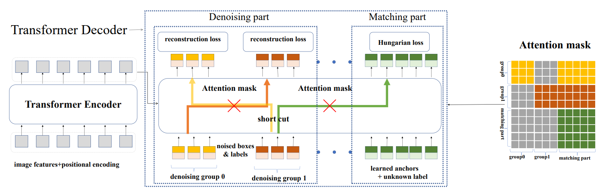

## DN-DETR: Accelerate DETR Training by Introducing Query DeNoising

Feng Li, Hao Zhang, Shilong Liu, Jian Guo, Lionel M.Ni, Lei Zhang

[[`arXiv`](https://arxiv.org/abs/2203.01305)] [[`BibTeX`](#citing-dn-detr)]

<div align="center">
  
</div><br/>

## Pretrained Models
<table><tbody>
<!-- START TABLE -->
<!-- TABLE HEADER -->
<th valign="bottom">Name</th>
<th valign="bottom">Backbone</th>
<th valign="bottom">Pretrain</th>
<th valign="bottom">box<br/>AP</th>
<th valign="bottom">download</th>
<!-- TABLE BODY -->
<!-- ROW: dab_detr_r50_50ep -->
 <tr><td align="left"><a href="configs/dab_detr_r50_50ep.py">DN-DETR-R50</a></td>
<td align="center">R-50</td>
<td align="center">IN1k</td>
<td align="center"></td>
<td align="center"> <a href="">Google Drive</a>&nbsp;|&nbsp;<a href="">Tsinghua Cloud</a></td>
</tr>
<!-- ROW: dab_detr_r101_50ep -->
 <tr><td align="left"><a href="configs/dab_detr_r101_50ep.py">DN-DETR-R101</a></td>
<td align="center">R-101</td>
<td align="center">IN1k</td>
<td align="center"></td>
<td align="center"> <a href="">Google Drive</a>&nbsp;|&nbsp;<a href="">Tsinghua Cloud</a></td>
</tr>
</tbody></table>

**Note:** DC5 means using dilated convolution in `res5`.


## Training
All configs can be trained with:
```bash
cd detrex
python tools/train_net.py --config-file projects/dn_detr/configs/path/to/config.py --num-gpus 8
```
By default, we use 8 GPUs with total batch size as 16 for training.

## Evaluation
Model evaluation can be done as follows:
```bash
cd detrex
python tools/train_net.py --config-file projects/dn_detr/configs/path/to/config.py --eval-only train.init_checkpoint=/path/to/model_checkpoint
```

## Citing DN-DETR
If you find our work helpful for your research, please consider citing the following BibTeX entry.

```BibTex
@inproceedings{li2022dn,
      title={Dn-detr: Accelerate detr training by introducing query denoising},
      author={Li, Feng and Zhang, Hao and Liu, Shilong and Guo, Jian and Ni, Lionel M and Zhang, Lei},
      booktitle={Proceedings of the IEEE/CVF Conference on Computer Vision and Pattern Recognition},
      pages={13619--13627},
      year={2022}
}
```
