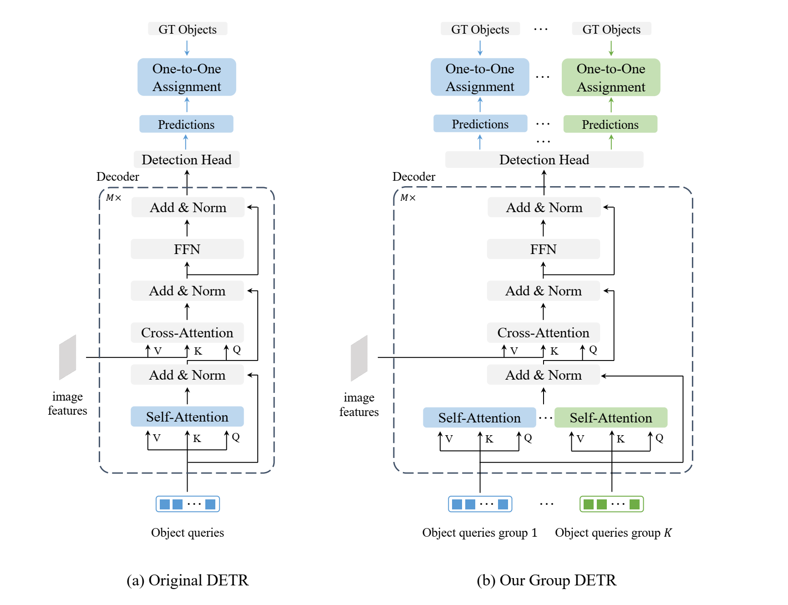

## Group DETR: Fast DETR Training with Group-Wise One-to-Many Assignment

Chen, Qiang and Chen, Xiaokang and Wang, Jian and Feng, Haocheng and Han, Junyu and Ding, Errui and Zeng, Gang and Wang, Jingdong

[[`arXiv`](https://arxiv.org/abs/2207.13085)] [[`BibTeX`](#citing-conditional-detr)]

<div align="center">
  
</div><br/>

## Training
All configs can be trained with:
```bash
cd detrex
python tools/train_net.py --config-file projects/group_detr/configs/path/to/config.py --num-gpus 8
```
By default, we use 8 GPUs with total batch size as 16 for training.

## Evaluation
Model evaluation can be done as follows:
```bash
cd detrex
python tools/train_net.py --config-file projects/group_detr/configs/path/to/config.py --eval-only train.init_checkpoint=/path/to/model_checkpoint
```

## Citing Group-DETR
If you find our work helpful for your research, please consider citing the following BibTeX entry.

```BibTex
@article{chen2022group,
  title={Group DETR: Fast DETR Training with Group-Wise One-to-Many Assignment},
  author={Chen, Qiang and Chen, Xiaokang and Wang, Jian and Feng, Haocheng and Han, Junyu and Ding, Errui and Zeng, Gang and Wang, Jingdong},
  journal={arXiv preprint arXiv:2207.13085},
  year={2022}
}
```
