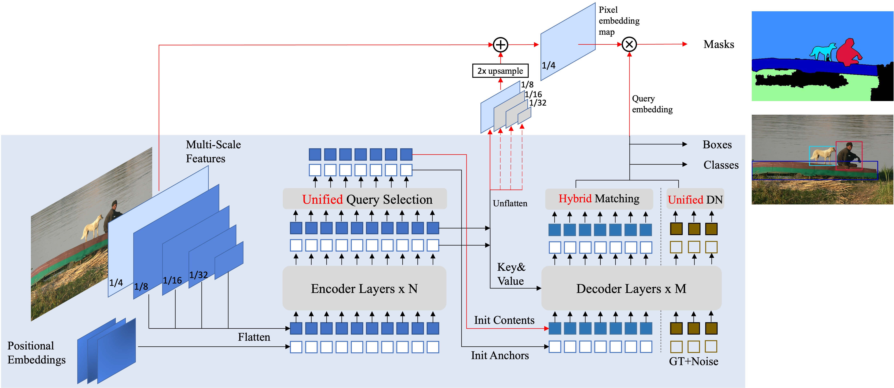

Mask DINO 
========
[](https://paperswithcode.com/sota/instance-segmentation-on-coco-minival?p=mask-dino-towards-a-unified-transformer-based-1)
[](https://paperswithcode.com/sota/instance-segmentation-on-coco?p=mask-dino-towards-a-unified-transformer-based-1)
[](https://paperswithcode.com/sota/semantic-segmentation-on-ade20k?p=mask-dino-towards-a-unified-transformer-based-1)
[](https://paperswithcode.com/sota/panoptic-segmentation-on-coco-minival?p=mask-dino-towards-a-unified-transformer-based-1)
[](https://paperswithcode.com/sota/panoptic-segmentation-on-coco-test-dev?p=mask-dino-towards-a-unified-transformer-based-1)

By [Feng Li*](https://fengli-ust.github.io/), [Hao Zhang*](https://scholar.google.com/citations?user=B8hPxMQAAAAJ&hl=zh-CN), [Huaizhe Xu](https://scholar.google.com/citations?user=zgaTShsAAAAJ&hl=en&scioq=Huaizhe+Xu), [Shilong Liu](https://www.lsl.zone/), [Lei Zhang](https://scholar.google.com/citations?hl=zh-CN&user=fIlGZToAAAAJ), [Lionel M. Ni](https://scholar.google.com/citations?hl=zh-CN&user=OzMYwDIAAAAJ), and [Heung-Yeung Shum](https://scholar.google.com.hk/citations?user=9akH-n8AAAAJ&hl=en).

This repository is an official detrex implementation of the [Mask DINO: Towards A Unified Transformer-based
Framework for Object Detection and Segmentation](https://arxiv.org/abs/2206.02777) (DINO pronounced `daɪnoʊ' as in dinosaur). The source code is available at [MaskDINO](https://github.com/IDEA-Research/MaskDINO).


### Features 

* A unified architecture for object detection, panoptic, instance and semantic segmentation.
* Achieve task and data cooperation between detection and segmentation.
* State-of-the-art performance under the same setting.
* Support major detection and segmentation datasets: COCO, ADE20K, Cityscapes,

### Code Updates

* [2022/11] Our code is available! Achieve <strong>51.7</strong> and <strong>59.0</strong> AP with a ResNet-50 and SwinL without extra detection data on COCO, better detection performance compared with DINO!

* [2022/6] We release a unified detection and segmentation model [Mask DINO](https://arxiv.org/pdf/2206.02777.pdf) that achieves the best results on all the three segmentation tasks (**54.7** AP on [COCO instance leaderboard](https://paperswithcode.com/sota/instance-segmentation-on-coco), **59.5** PQ on [COCO panoptic leaderboard](https://paperswithcode.com/sota/panoptic-segmentation-on-coco-test-dev), and **60.8** mIoU on [ADE20K semantic leaderboard](https://paperswithcode.com/sota/semantic-segmentation-on-ade20k))!.





## Installation

See [installation instructions](INSTALL.md).

## Getting Started

See [Results](#results).

See [Preparing Datasets for MaskDINO](datasets/README.md).

See [More Usage](#more-usage).

# Results
## Released Models
### COCO Instance Segmentation and Object Detection
In this part, we follow DINO to use hidden dimension `2048` in the encoder by default. We also use the mask-enhanced
box initialization proposed in our paper by default. To better present our model, we also list the models trained with 
hidden dimension `1024` (`hid 1024`) and not using mask-enhance initialization (`no mask enhance`) in this table.
<table><tbody>
<!-- START TABLE -->
<!-- TABLE HEADER -->
<th valign="bottom">Name</th>
<th valign="bottom">Backbone</th>
<th valign="bottom">Epochs</th>
<th valign="bottom">Mask AP</th>
<th valign="bottom">Box AP</th>
<th valign="bottom">Params</th>
<th valign="bottom">GFlops</th>
<th valign="bottom">download</th>

 <tr><td align="left">MaskDINO (hid 1024)</td>
<td align="center">R50</td>
<td align="center">50</td>
<td align="center">46.1</td>
<td align="center">51.5</td>
<td align="center">47M</td>
<td align="center">226</td>
<td align="center"><a href="https://github.com/IDEA-Research/detrex-storage/releases/download/maskdino-v0.1.0/maskdino_r50_50ep_300q_hid1024_3sd1_instance_maskenhanced_mask46.1ap_box51.5ap.pth">model</a></td>
</tr>

 <tr><td align="left">MaskDINO | <a href="configs/maskdino_r50_coco_instance_seg_50ep.py">config</a></td>
<td align="center">R50</td>
<td align="center">50</td>
<td align="center">46.3</td>
<td align="center">51.7</td>
<td align="center">52M</td>
<td align="center">286</td>
<td align="center"><a href="https://github.com/IDEA-Research/detrex-storage/releases/download/maskdino-v0.1.0/maskdino_r50_50ep_300q_hid2048_3sd1_instance_maskenhanced_mask46.3ap_box51.7ap.pth">model</a></td>
</tr>

 
</tbody></table>

### COCO Panoptic Segmentation

<table><tbody>
<!-- START TABLE -->
<!-- TABLE HEADER -->
<th valign="bottom">Name</th>
<th valign="bottom">Backbone</th>
<th valign="bottom">epochs</th>
<th valign="bottom">PQ</th>
<th valign="bottom">Mask AP</th>
<th valign="bottom">Box AP</th>
<th valign="bottom">mIoU</th>
<th valign="bottom">download</th>

 <tr><td align="left">MaskDINO | <a href="configs/maskdino_r50_coco_panoptic_seg_50ep.py">config</a></td>
<td align="center">R50</td>
<td align="center">50</td>
<td align="center">53.0</td>
<td align="center">48.8</td>
<td align="center">44.3</td>
<td align="center">60.6</td>
<td align="center"><a href="https://github.com/IDEA-Research/detrex-storage/releases/download/maskdino-v0.1.0/maskdino_r50_50ep_300q_hid2048_3sd1_panoptic_pq53.0.pth">model</a></td>

</tbody></table>

## To Release
These models can be found and tested in [MaskDINO Source Code](https://github.com/IDEA-Research/MaskDINO) and will be available soon in detrex.

### COCO Instance Segmentation and Object Detection
In this part, we follow DINO to use hidden dimension `2048` in the encoder by default. We also use the mask-enhanced
box initialization proposed in our paper by default. To better present our model, we also list the models trained with 
hidden dimension `1024` (`hid 1024`) and not using mask-enhance initialization (`no mask enhance`) in this table.
<table><tbody>
<!-- START TABLE -->
<!-- TABLE HEADER -->
<th valign="bottom">Name</th>
<th valign="bottom">Backbone</th>
<th valign="bottom">Epochs</th>
<th valign="bottom">Mask AP</th>
<th valign="bottom">Box AP</th>
<th valign="bottom">Params</th>
<th valign="bottom">GFlops</th>
<th valign="bottom">download</th>

 

 <tr><td align="left">MaskDINO (no mask enhance) | <a href="configs/coco/instance-segmentation/swin/maskdino_R50_bs16_50ep_4s_dowsample1_2048.yaml">config</a></td>
<td align="center">Swin-L (IN21k)</td>
<td align="center">50</td>
<td align="center">52.1</td>
<td align="center">58.3</td>
<td align="center">223</td>
<td align="center">1326</td>
<td align="center"><a href="https://github.com/IDEA-Research/detrex-storage/releases/download/maskdino-v0.1.0/maskdino_swinl_50ep_300q_hid2048_3sd1_instance_mask52.1ap_box58.3ap.pth">model</a></td>
</tr>

 <tr><td align="left">MaskDINO | <a href="configs/coco/instance-segmentation/swin/maskdino_R50_bs16_50ep_4s_dowsample1_2048.yaml">config</a></td>
<td align="center">Swin-L (IN21k)</td>
<td align="center">50</td>
<td align="center">52.3</td>
<td align="center">59.0</td>
<td align="center">223</td>
<td align="center">1326</td>
<td align="center"><a href="https://github.com/IDEA-Research/detrex-storage/releases/download/maskdino-v0.1.0/maskdino_swinl_50ep_300q_hid2048_3sd1_instance_maskenhanced_mask52.3ap_box59.0ap.pth">model</a></td>
</tr>
</tbody></table>

### COCO Panoptic Segmentation

<table><tbody>
<!-- START TABLE -->
<!-- TABLE HEADER -->
<th valign="bottom">Name</th>
<th valign="bottom">Backbone</th>
<th valign="bottom">epochs</th>
<th valign="bottom">PQ</th>
<th valign="bottom">Mask AP</th>
<th valign="bottom">Box AP</th>
<th valign="bottom">mIoU</th>
<th valign="bottom">download</th>

 <tr><td align="left">MaskDINO | <a href="configs/coco/panoptic-segmentation/swin/maskdino_R50_bs16_50ep_4s_dowsample1_2048.yaml">config</a></td>
<td align="center">Swin-L (IN21k)</td>
<td align="center">50</td>
<td align="center">58.3</td>
<td align="center">50.6</td>
<td align="center">56.2</td>
<td align="center">67.5</td>
<td align="center"><a href="https://github.com/IDEA-Research/detrex-storage/releases/download/maskdino-v0.1.0/maskdino_swinl_50ep_300q_hid2048_3sd1_panoptic_58.3pq.pth">model</a></td>
</tr>
</tbody></table>

### ADE20K Semantic Segmentation

<table><tbody>
<!-- START TABLE -->
<!-- TABLE HEADER -->
<th valign="bottom">Name</th>
<th valign="bottom">Dataset</th>
<th valign="bottom">Backbone</th>
<th valign="bottom">iterations</th>
<th valign="bottom">mIoU</th>
<th valign="bottom">download</th>

 <tr><td align="left">MaskDINO | <a href="configs/cityscapes/semantic-segmentation/maskdino_R50_bs16_90k_steplr.yaml">config</a></td>
<td align="center">ADE20K</td>
<td align="center">R50</td>
<td align="center">160k</td>
<td align="center">48.7</td>
<td align="center"><a href="https://github.com/IDEA-Research/detrex-storage/releases/download/maskdino-v0.1.0/maskdino_r50_50ep_100q_celoss_hid1024_3s_semantic_ade20k_48.7miou.pth">model</a></td>

 <tr><td align="left">MaskDINO | <a href="configs/cityscapes/semantic-segmentation/maskdino_R50_bs16_90k_steplr.yaml">config</a></td>
<td align="center">Cityscapes</td>
<td align="center">R50</td>
<td align="center">90k</td>
<td align="center">79.8</td>
<td align="center"><a href="https://github.com/IDEA-Research/detrex-storage/releases/download/maskdino-v0.1.0/maskdino_r50_50ep_100q_celoss_hid1024_3s_semantic_cityscapes_79.8miou.pth">model</a></td>

</tbody></table>

All models were trained with  **4** NVIDIA A100 GPUs (ResNet-50 based models) or **8** NVIDIA A100 GPUs (Swin-L based models).


# More Usage

### Mask-enhanced box initialization

We provide 2 ways to convert predicted masks to boxes to initialize decoder boxes. You can set as follows
* `MODEL.MaskDINO.INITIALIZE_BOX_TYPE: no` not using mask enhanced box initialization
* `MODEL.MaskDINO.INITIALIZE_BOX_TYPE: mask2box`  a fast conversion way
* `MODEL.MaskDINO.INITIALIZE_BOX_TYPE: bitmask`  provided conversion from detectron2, slower but more accurate conversion. 

These two conversion ways do not affect the final performance much, you can choose either way. 

In addition, if you already
train a model for 50 epochs without mask-enhance box initialization, you can plug in this method and simply 
finetune the model in the last few epochs (i.e., load from 32K iteration trained model and finetune it). This way can
also achieve similar performance compared with training from scratch, but more flexible.

### Model components
MaskDINO  consists of three components: a backbone, a pixel decoder and a Transformer decoder.
You can easily replace each of these three components with your own implementation.

* **backbone**: Define and register your backbone under `maskdino/modeling/backbone`. You can follow the Swin Transformer as an example.
  
* **pixel decoder**: pixel decoder is actually the multi-scale encoder in DINO and Deformable DETR, we follow mask2former to call
  it pixel decoder. It is in `maskdino/modeling/pixel_decoder`, you can change your multi-scale encoder. The returned values 
  include 
  1. `mask_features` is the per-pixel embeddings with resolution 1/4 of the original image, obtained by fusing backbone 1/4 features and multi-scale encoder encoded 1/8 features. This is used to produce binary masks.
  2. `multi_scale_features`, which is the multi-scale inputs to the Transformer decoder.
  For ResNet-50 models with 4 scales, we use resolution 1/32, 1/16, and 1/8 but you can use arbitrary resolutions here, and follow DINO to additionally downsample
     1/32 to get a 4th scale with 1/64 resolution. For 5-scale models with SwinL, we additional use 1/4 resolution features as in DINO.

* **transformer decoder**: it mainly follows DINO decoder to do detection and segmentation tasks. It is defined in `maskdino/modeling/transformer_decoder`.


## LICNESE
Mask DINO is released under the Apache 2.0 license. Please see the [LICENSE](LICNESE) file for more information.

Copyright (c) IDEA. All rights reserved.

Licensed under the Apache License, Version 2.0 (the "License"); you may not use these files except in compliance with the License. You may obtain a copy of the License at http://www.apache.org/licenses/LICENSE-2.0

Unless required by applicable law or agreed to in writing, software distributed under the License is distributed on an "AS IS" BASIS, WITHOUT WARRANTIES OR CONDITIONS OF ANY KIND, either express or implied. See the License for the specific language governing permissions and limitations under the License.

## <a name="CitingMaskDINO"></a>Citing Mask DINO

If you find our work helpful for your research, please consider citing the following BibTeX entry.

```BibTeX
@misc{li2022mask,
      title={Mask DINO: Towards A Unified Transformer-based Framework for Object Detection and Segmentation}, 
      author={Feng Li and Hao Zhang and Huaizhe xu and Shilong Liu and Lei Zhang and Lionel M. Ni and Heung-Yeung Shum},
      year={2022},
      eprint={2206.02777},
      archivePrefix={arXiv},
      primaryClass={cs.CV}
}
```

If you find the code useful, please also consider the following BibTeX entry.

```BibTeX
@misc{zhang2022dino,
      title={DINO: DETR with Improved DeNoising Anchor Boxes for End-to-End Object Detection}, 
      author={Hao Zhang and Feng Li and Shilong Liu and Lei Zhang and Hang Su and Jun Zhu and Lionel M. Ni and Heung-Yeung Shum},
      year={2022},
      eprint={2203.03605},
      archivePrefix={arXiv},
      primaryClass={cs.CV}
}

@inproceedings{li2022dn,
      title={Dn-detr: Accelerate detr training by introducing query denoising},
      author={Li, Feng and Zhang, Hao and Liu, Shilong and Guo, Jian and Ni, Lionel M and Zhang, Lei},
      booktitle={Proceedings of the IEEE/CVF Conference on Computer Vision and Pattern Recognition},
      pages={13619--13627},
      year={2022}
}

@inproceedings{
      liu2022dabdetr,
      title={{DAB}-{DETR}: Dynamic Anchor Boxes are Better Queries for {DETR}},
      author={Shilong Liu and Feng Li and Hao Zhang and Xiao Yang and Xianbiao Qi and Hang Su and Jun Zhu and Lei Zhang},
      booktitle={International Conference on Learning Representations},
      year={2022},
      url={https://openreview.net/forum?id=oMI9PjOb9Jl}
}
```

## Acknowledgement

Many thanks to these excellent opensource projects 
* [Mask2Former](https://github.com/facebookresearch/Mask2Former) 
* [DINO](https://github.com/IDEA-Research/DINO)

