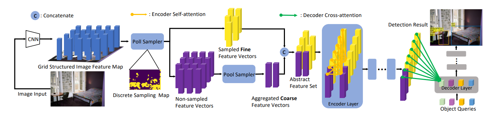

## PnP-DETR: Towards Efficient Visual Analysis with Transformers

Tao Wang, Li Yuan, Yunpeng Chen, Jiashi Feng, Shuicheng Yan

[[`arXiv`](https://arxiv.org/abs/2109.07036)] [[`BibTeX`](#citing-pnp-detr)]

<div align="center">
  
</div><br/>


## Training
Training PnP-DETR model for 300 epochs:
```bash
cd detrex
python tools/train_net.py --config-file projects/pnp_detr/configs/pnp_detr_r50_300ep.py --num-gpus 8
```
By default, we use 8 GPUs with total batch size as 64 for training.

## Evaluation
Model evaluation can be done as follows:
```bash
cd detrex
python tools/train_net.py --config-file projects/pnp_detr/configs/path/to/config.py \
    --eval-only train.init_checkpoint=/path/to/model_checkpoint
```


## Citing PnP-DETR
```BibTex
@inproceedings{wang2021pnp,
  title={PnP-DETR: Towards Efficient Visual Analysis with Transformers},
  author={Wang, Tao and Yuan, Li and Chen, Yunpeng and Feng, Jiashi and Yan, Shuicheng},
  booktitle={Proceedings of the IEEE/CVF International Conference on Computer Vision},
  pages={4661--4670},
  year={2021}
}
```