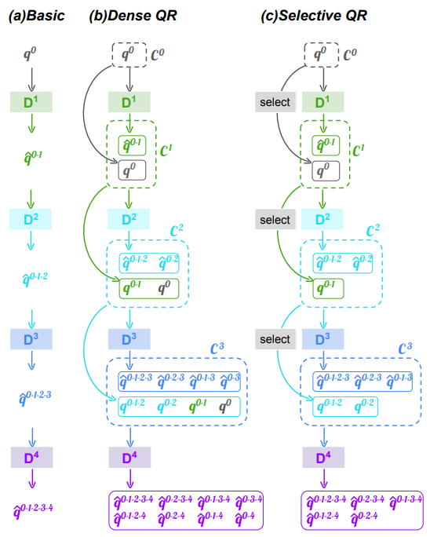

## Enhanced Training of Query-Based Object Detection via Selective Query Recollection

Chen, Fangyi and Zhang, Han and Hu, Kai and Huang, Yu-Kai and Zhu, Chenchen and Savvides, Marios

[[`arXiv`](https://openaccess.thecvf.com/content/CVPR2023/papers/Chen_Enhanced_Training_of_Query-Based_Object_Detection_via_Selective_Query_Recollection_CVPR_2023_paper.pdf)] [[`BibTeX`](#citing-sqr-detr)]

<div align="center">
  
</div><br/>

## Pretrained Models
Here we provide the pretrained `SQR-DAB-DETR` weights based on detrex. 

An MMDet implementation of SQR-Adamixer and SQR-Deformable-DETR can be found [here](https://github.com/Fangyi-Chen/SQR).

<table><tbody>
<!-- START TABLE -->
<!-- TABLE HEADER -->
<th valign="bottom">Name</th>
<th valign="bottom">Backbone</th>
<th valign="bottom">Pretrain</th>
<th valign="bottom">Epochs</th>
<th valign="bottom">box<br/>AP</th>
<th valign="bottom">download</th>
<!-- TABLE BODY -->
<!-- ROW: dab_detr_r50_50ep -->
 <tr><td align="left"><a href="configs/dab_detr_r50_50ep_sqr.py">SQR-DAB-DETR</a></td>
<td align="center">R-50</td>
<td align="center">IN1k</td>
<td align="center">50</td>
<td align="center">44.4</td>
<td align="center"> <a href="https://drive.google.com/file/d/1Zz298GPYvDfF1RjSTk1e_ZoBy3NtXxWd/view?usp=sharingh">model</a></td>
</tr>
</tbody></table>


## Training
It can be trained with:
```bash
cd detrex
python tools/train_net.py --config-file projects/sqr_detr/configs/path/to/config.py --num-gpus 8
```
By default, we use 8 GPUs with total batch size as 16 for training.

## Evaluation
Model evaluation can be done as follows:
```bash
cd detrex
python tools/train_net.py --config-file projects/sqr_detr/configs/path/to/config.py --eval-only train.init_checkpoint=/path/to/model_checkpoint
```

## Citing SQR-DETR
If you find our work helpful for your research, please consider citing the following BibTeX entry.

```BibTex
@InProceedings{Chen_2023_CVPR,
    author    = {Chen, Fangyi and Zhang, Han and Hu, Kai and Huang, Yu-Kai and Zhu, Chenchen and Savvides, Marios},
    title     = {Enhanced Training of Query-Based Object Detection via Selective Query Recollection},
    booktitle = {Proceedings of the IEEE/CVF Conference on Computer Vision and Pattern Recognition (CVPR)},
    month     = {June},
    year      = {2023},
    pages     = {23756-23765}
}
```
